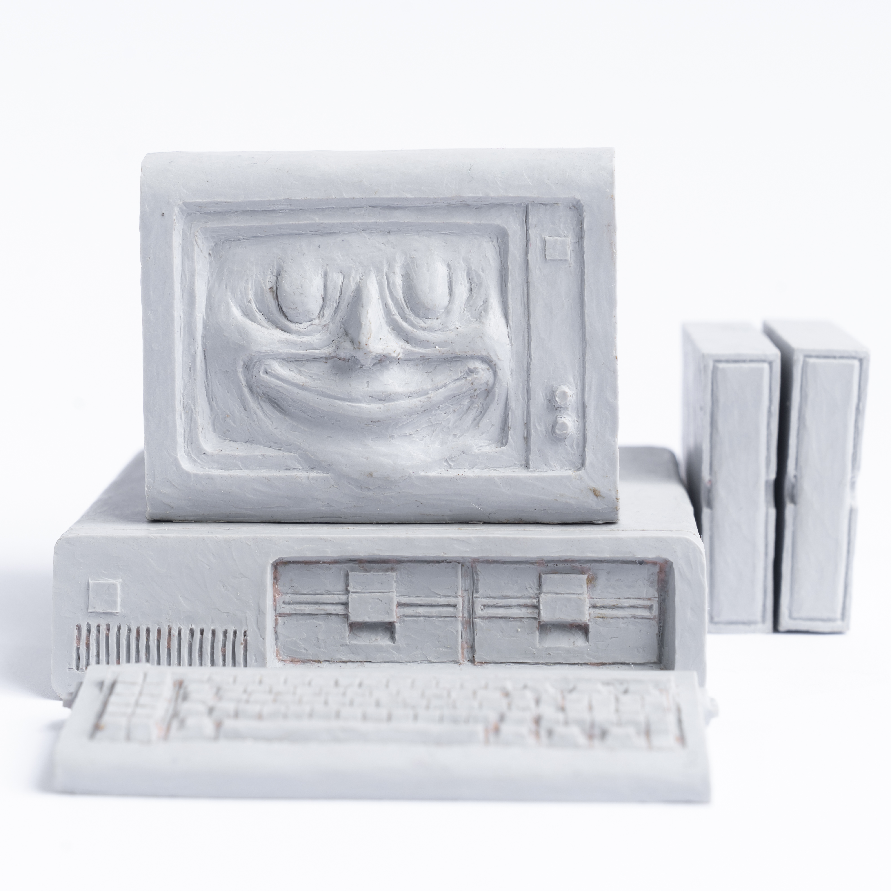
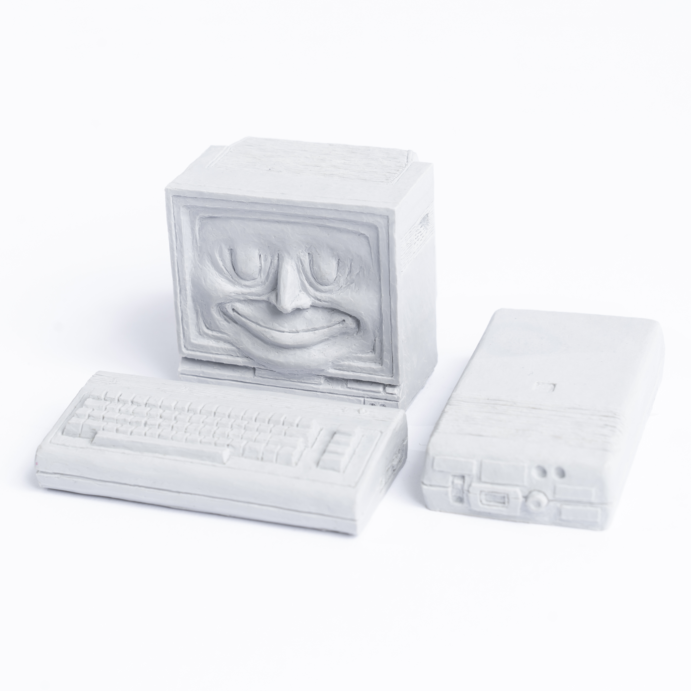
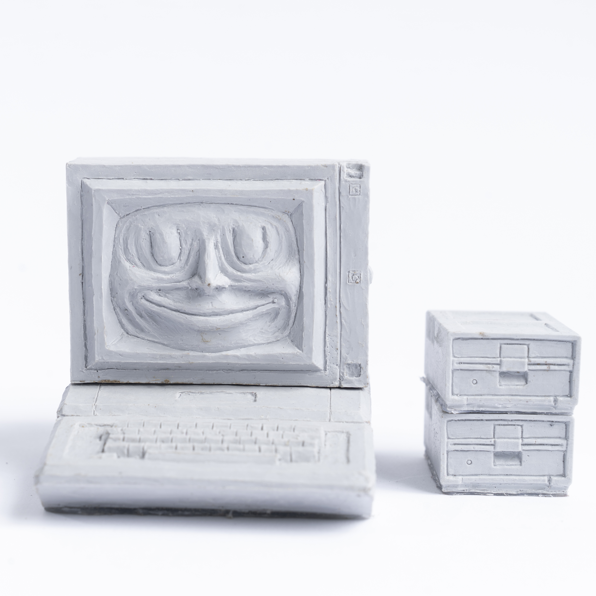

# Computer Buddies

Some things I sculpted. First in oil clay then cast in resin and concrete mostly at 1:6 scale. Pay what you want if you want one as I cast more.

[tombetthauser](http://tombetthauser.com)

