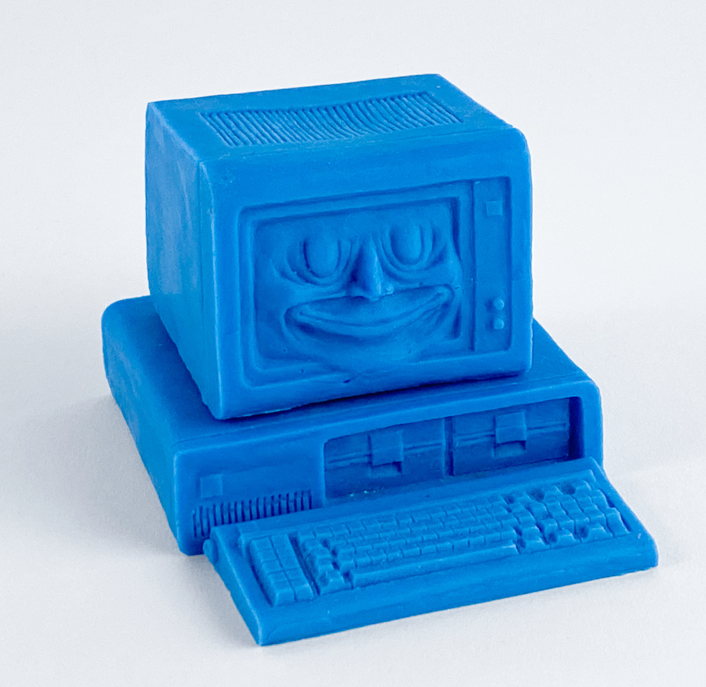
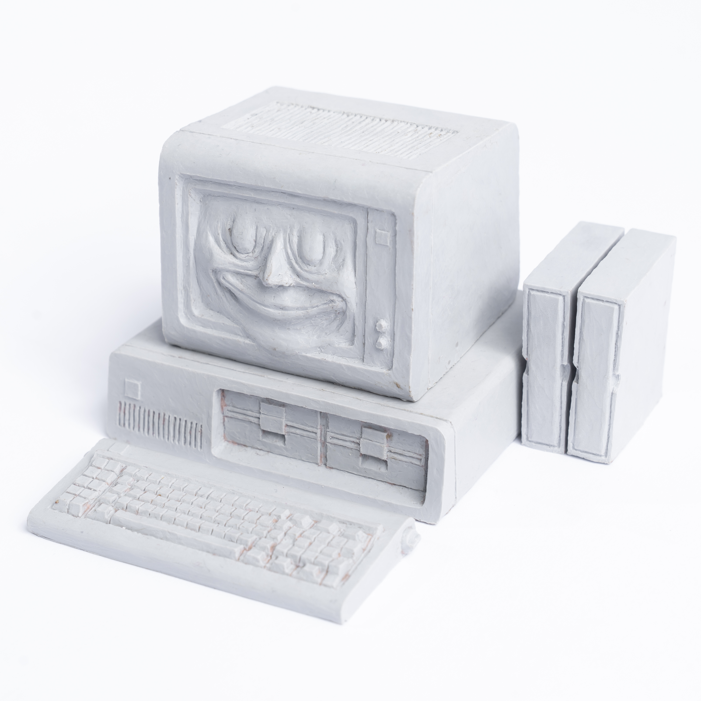
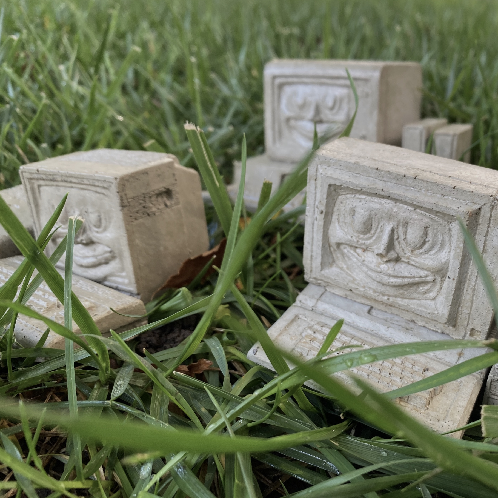
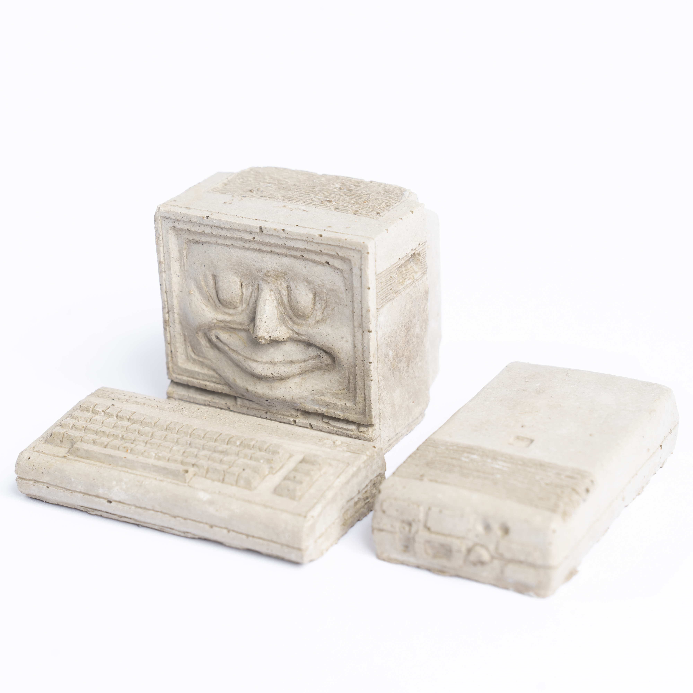

# Computer Buddies

Some things I made for my kid sort of. Hand sculpted at 1:6 scale in oil clay then cast in natural wax, resin, concrete and other stuff.

<a href="<https://tombetthauser.github.io/computerbuddies>">https://tombetthauser.github.io/computerbuddies</a> 
<a href="<http://tombetthauser.com>">http://tombetthauser.com</a> 
<a href="#hello">tombetthauser@gmail.com</a> 

---

## If you want one...

$100 buys you the computer buddy of your choice and a hand-drawn post-it note portrait to be included in a free-to-download zine later this year.

All proceeds go to covering materials costs and convention fees. Any extra money will be donated to local hacker spaces in Sacramento, CA.

      
      
      
       <!-- steve top concrete -->
       <!-- steve front resin -->
       <!-- don medium angle resin -->
      
      <!-- don low angle concrete -->
      <!-- don top concrete -->
       
       <!-- steve medium angle concrete -->
      
      <!--   -->
       <!-- bob top concrete -->
      <!-- bob front resin -->
       
      
the disk drive is backwards...

      <!--  bob medium angle concrete -->
      <!--  bob medium angle resin -->
      <!--  -->
      <!--  -->
    </section>
  </body>
</body>
</html>
